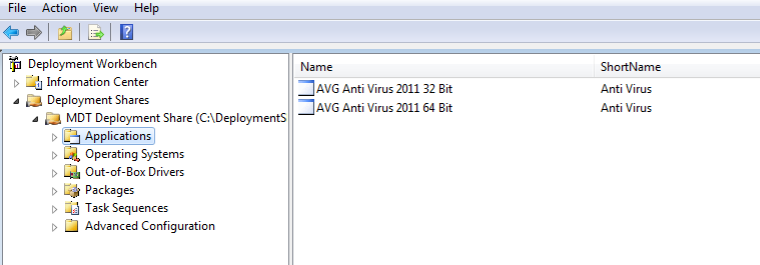
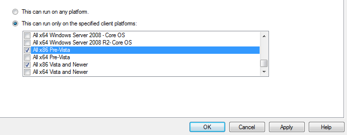
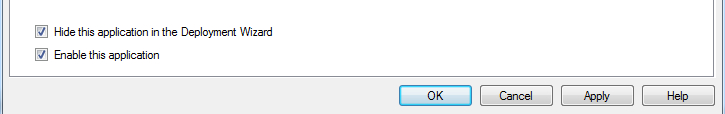
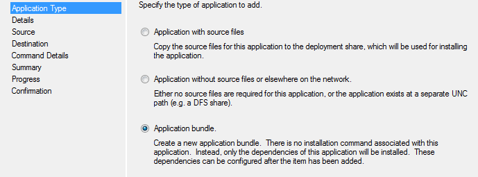
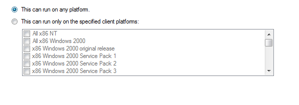
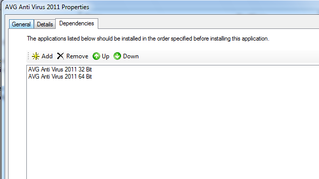
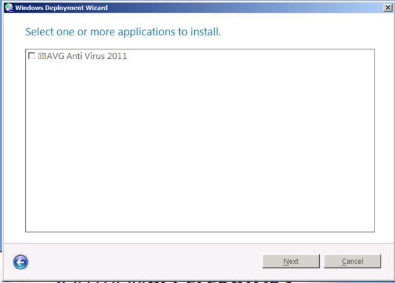

In MDT 2010, you can create application bundles.  An application bundle is simply a list of dependencies or a list of applications to be installed.  In this example, an application bundle can be used to bundle 32bit and 64bit versions of an application.  Here is how to do this :

We will assume that we have set up both the 32bit and 64bit version of the software.  In this example I am using AVG

Now we need to limit the platform that each application can install on.  This is done on the Details tab of the application properties.  To limit to only 32 bit versions of Windows, we select “All x86 Pre-Vista” and “All x86 Vista and Newer”  This will cover all 32 bit version of Windows.  For the 64 bit version of the software, we simply choose the corresponding x64 options.

Now, since we will be calling this appplication from the bundle and not directly we will hide it in the Wizard.  This is on the General tab of the application properties.  Again, we want to do this to both versions of the application.

Now we create a new application, this time choosing “Application Bundle” as the type.  The wizard will create the bundle with very few details and we will then go into the properties to modify it.

For the bundle, we want it to run on all platforms.

On the Dependencies tab, we can now add the two versions of the application install.  Simply click “add” and you will get a list of all the applications in your Deployment Share.  The the two you need, and you are done.

The image below shows what it will look like during the lite touch deployment wizard.  As we wanted, only the bundle application shows in the list.  We can select it regardless of what windows platform we are deploying and the correct installation will be used.

I find this to be a helpful way to keep the deployment process simple and consistent for the technitions deploying computers.
