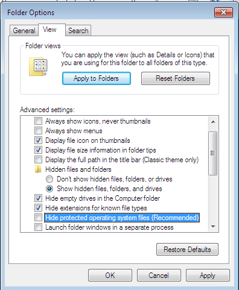
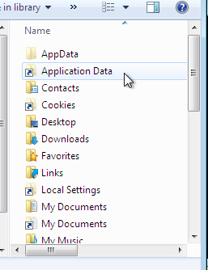
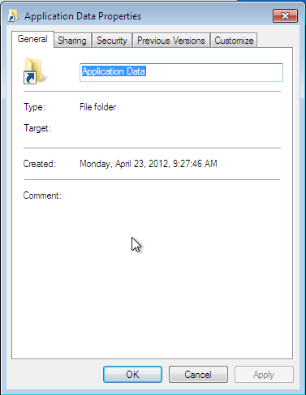
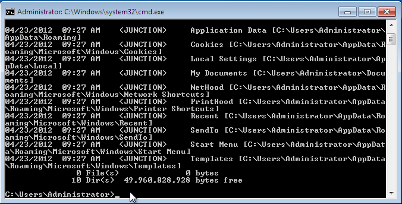
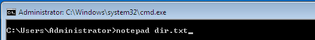
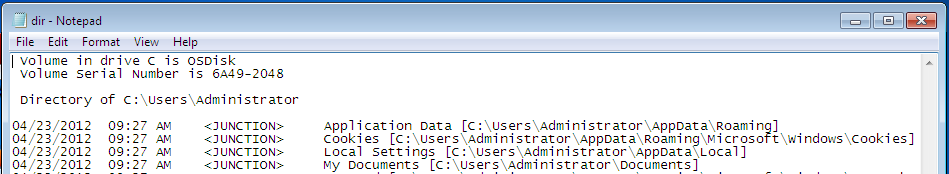
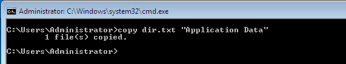
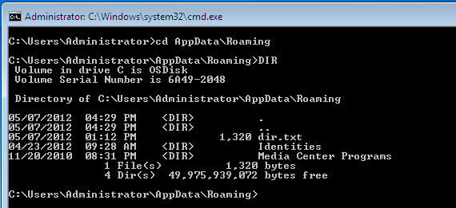

So I recently fielded a question from someone new to Windows 7 about some “directories” that they were being denied access to.  This seemed odd, because it was under the user profile so they should not have been a permissions issue.

I inquired about some more specifics, and the list of problem directories were Application Data, Cookies, Local Settings, etc…  I recognized right away that these were Windows XP directories which should not normally show up for a user in Windows 7.  What these really are is Directory Junction points provided by Microsoft to maintain compatibility with software written for previous versions of Windows.  Starting with Windows Vista, Microsoft changed the structure of the user profile namespace.  The result of this is that Directory Junction points are needed to route files to the new locations even when the old style path is specified.

So lets take a look at these Directory Junctions.  They are flagged with both the Hidden and System attributes, so to see them we need to change our view settings :

Once we have chosen to both “Show hidden files, folders, or drives” and unticked “Hide protected operating system files” we will now be able to see these junctions in an explorer window.

Ok, so now that we can see them, lets see if we can find out some more information.  Lets right-click on one and go to Properties..

Hmm…  Not much useful information here.  Clearly it is not a normal folder, but that is what the properties is indicating.  OK, we are going to need to go to the command line to dig a little deeper.  At a command prompt we can enter the command `dir /al` to see a list of the junctions and some information about them :

This information is not very readable, so lets do it differently.  The following command will pipe the results of the command to a text file named dir.txt

Now, open the text file in notepad with the following command :

Ahh..  this is a bit easier to read..

So what are we looking at here?  If we look at Application Data, we can see that the path it is linking to it `c:\users\administrator\AppData\Roaming`   This means that if we try to copy a file to `c:\users\administrator\application data`   it will actually go to `c:\users\administrator\AppData\Roaming`  In this way, files destined for the old locations used in Pre-Vista versions will land in the correct new locations.

So lets do a little demonstration…  If your following along, you should still have the command prompt window open.  lets go ahead and copy our text file to “Application Data”

Now, lets change to AppData\Roaming  and do a directory listing there :

Given what we now know, it should not be a surprise to see that our `dir.txt` file ended up in `c:\users\administrator\AppData\Roaming`