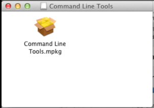
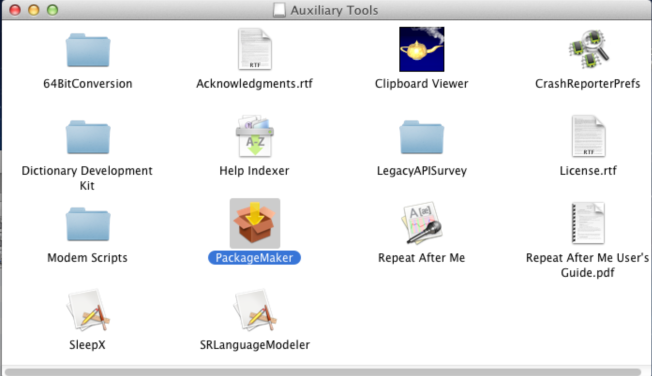
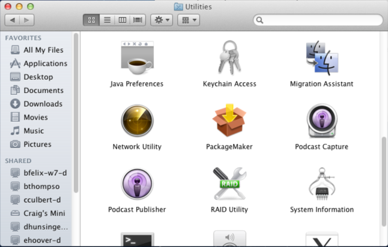
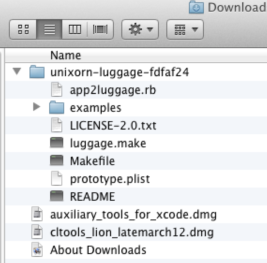
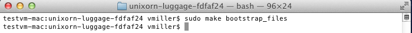

When administering and or deploying Mac OS systems, it becomes very useful to be able to create packages.  This can be to repackage an app to automate deployment, or package up scripts or configuration files.  One such tool to do this is The Luggage.  Written by Joe Block, it is a command line tool that makes use of Apple’s Packagemaker as well as Make.  More information can be found [here](http://luggage.apesseekingknowledge.net/).

This post is intended to walk you through getting up and running with luggage from ground zero.  A future post will look at using The Luggage.  This tutorial is assuming you are running Mac OS 10.7.

**Requirements :**
* PackageMaker.app
* XCode command line tools
* The Luggage

Lets start be going to [developer.apple.com/downloads](https://developer.apple.com/downloads) to download the tools we need from Apple.  You will need to sign in with an Apple ID, but do not need to have a paid developer account to get the tools we need.  In the search box, enter “for Xcode” to narrow our downloads.  First, download the “Command Line Tools for Xcode”   Second, download the “Auxiliary Tools for Xcode”

Now we can open the Downloads folder and install the Apple components that we need.  First open the Command Line Tools disk image and we see that it is a single meta package installer.  Go ahead and install it accepting the defaults.

Next, we need to install PackageMaker.app from the Auxiliary Tools.  Open the disk image for for the Auxiliary Tools from the Downloads folder.  We will see multiple items in this image, but PackageMaker is the only one we are interested in for this tutorial.  PackageMaker is a drag and drop app, so lets just drag it into `/Applications/Utilities`

Thats all we need from Apple, go ahead and eject the disk images and we’ll move on to installing The Luggage.

We will download The Luggage from https://github.com/unixorn/luggage  We can download it using the **ZIP** button, the result will be a folder with several files in your Downloads folder.  Go ahead and copy this into your Home folder (really, you can put this anywhere you wish).

Now, we just need to run a command to configure luggage for use.  Change into the luggage directory and execute the following command :

Now Luggage is ready for use and we can start packaging, go [here]() for the next installment of the series which demonstrates how to package a drag and drop style application.
