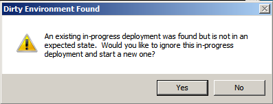
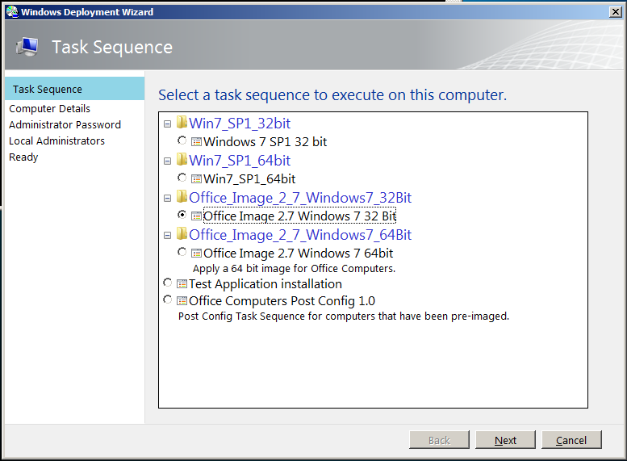

I’ve been working with MDT 2012 in my test environment, and here are three new features that I really like.

**Dirty Environment Cleanup**

Some times a deployment fails from some reason, and you just want to restart the process of a bare metal install.  In MDT 2010, the task sequence would read the logs written to the hard drive and realize that a deployment was still in progress.  At this point, MDT 2010 will halt the process with an error.  Pressing F8 and using diskpart to wipe the disk is my usual work around, but it is a bit clumsy for less experienced technicians.

In MDT 2012, if we boot to Windows PE and a previous deployment is detected we get the following dialog :

Nice!  Instead of assuming that we booted into Windows PE by accident, MDT 2012 allows for us to start over from scratch.  If we did do it by accident, we can simply click No and reboot to the hard drive.

**Deploy 32bit and 64bit Images from the Same Boot Media**

Apparently this has been available in SCCM, but not in Lite Touch deployments prior to now.  In MDT 2012 both 64bit and 32bit task sequences will work when booting to the 32bit Windows PE media.  This means only needing to maintain one media, and that the technicians deploying machines can always boot from the same media.

**Local Administrators Wizard Page**

In my organization, we usually make the primary user of a computer a local administrator.  This is a step that was being done manually after the MDT deployment completed.  This is something I was hoping to add a custom wizard page for (at some point when I could find some time to learn how to do that).  It was a pleasant suprise when I discovered that MDT 2012 included this.  I happened to be poking around in the scripts folder of my test deployment share and found the `DeployWiz_AdminAccounts.xml` file.  Adding `SkipAdminAccounts=NO`  to `CustomSettings.ini` results in an extra wizard page being displayed :

Adding accounts here in the form of `DOMAIN\user` will result in those accounts being added to the local administrators group of the computer.  I still want to learn to add my own wizard page, but this is one that I won’t have to…

These are some new features that will be really useful to me in my environment.  If you have found new features you like, feel free to leave a comment.