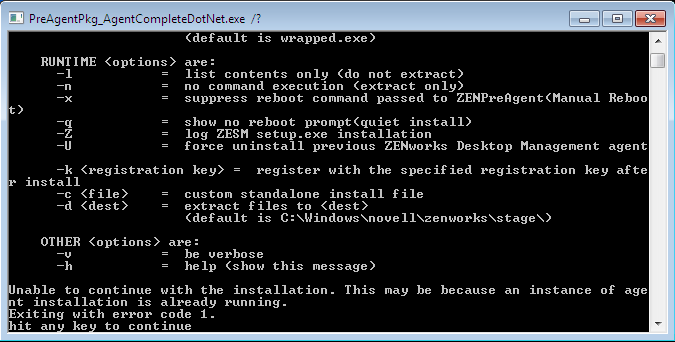
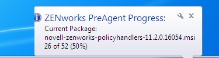
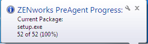

The Novell ZCM Adaptive Agent is an example of an application that needs to be installed at deployment time and should not be included in the reference image.  In general, MDT Lite Touch handles installing applications at deployment time quite nicely.

The Adaptive agent, however is an example of an install process that does not play nice with MDT.  It really is a quite horrible installer.  First, lets take a look at the installer and what it does.

We know that to successfully install applications in MDT we need an unattended install that does not force a reboot (both of these are critical to success).  Our first step should be to look for command line switches to give us our silent install.  If we run `PreAgentPkg_AgentCompleteDotNet.exe /?` from a command line, we get the following information :



OK, it looks like we should be able to run `PreAgentPkg_AgentCompleteDotNet -q -x` to achieve our unattended install.  Lets go ahead and run this from a command prompt on our test system to see what happens.

The first thing we notice is that we get returned to the command prompt immediately.  Looking at the task manager, we can see that the exe is running.


After a time, though, the exe exits and we see some activity in the system tray :



Yes, thats right…  It kicks off a series of 52 individual packages!  Remember that it has already returned as if the process finished successfully.  This poses a problem in MDT.  MDT will start the next installation thinking that this one is finished.  Since we cannot have multiple msi isntallations running at the same time, one of them will fail.

What we need to do, then, is find a way to wrap this pesky installer in a script that can wait until it is finished.  Back to our test installation, we can see the last package to run is setup.exe :



Then when done, it just waits for a reboot


Armed with this knowledge, we can throw together a vbscript to launch the install with the proper switches and then wait for completion.

```
Set objShell = CreateObject("Shell.Application")
objShell.ShellExecute "PreAgentPkg_AgentCompleteDotNet.exe", "-q " & "-x"
 
strComputer = "." ' local computer
strProcess = "Setup.exe"
 
Do Until isProcessRunning(strComputer,strProcess)
  WScript.Sleep(5000)
Loop
 
Do While isProcessRunning(strComputer,strProcess)
  WScript.Sleep(5000)
Loop
 
WScript.Quit 0
 
' Function to check if a process is running
FUNCTION isProcessRunning(BYVAL strComputer,BYVAL strProcessName)
 
DIM objWMIService, strWMIQuery
strWMIQuery = "Select * from Win32_Process where name like '" & strProcessName & "'"
 
SET objWMIService = GETOBJECT("winmgmts:" _
 & "{impersonationLevel=impersonate}!\\" _
 & strComputer & "\root\cimv2")
 
IF objWMIService.ExecQuery(strWMIQuery).Count > 0 THEN
 isProcessRunning = TRUE
ELSE
 isProcessRunning = FALSE
END IF
 
END FUNCTION
```

The script makes use of a function to determine if a process is running.  In this case we want to see if setup.exe is running.  At the start, setup.exe is not running yet, and we use a loop to keep checking (and then sleeping) until it is running.  We then have a second loop that keeps checking until setup.exe is no longer running.  At this point we know the install is finished, and can exit the script.

This script is a bit crude, and lacks error checking but it does work.  To use it, place the script in the same directory as the Preagent installer.  When importing it as an application into MDT, set the Quiet install command to be : `cscript install.vbs`