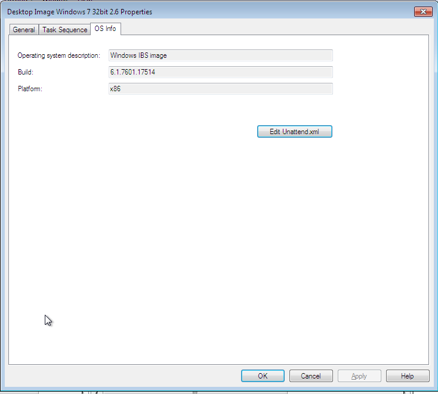
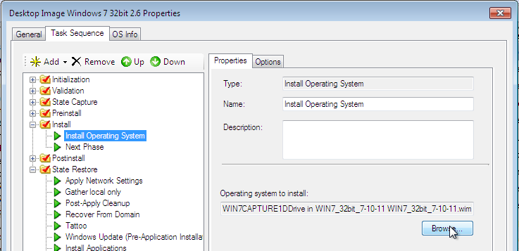

This is something that bugged me for a while, and I just stumbled across an answer…

When you create a new “Standard Client Task Sequence” to deploy an OS, the first thing you are prompted for after choosing the template is the OS.  I wanted to know how to specify a different OS for an existing task Sequence.   The obvious scenario for this would be when have updated a reference image but do not want to recreate a custom task sequence.

The OS Info tab of the task sequence properties would seem to be the logical place for this, but there is no place to change the OS here

Instead, if you go to the task sequence tab and expand the Install section.  You can go into the Install Operating System step and click on Browse to pick another OS (that you have previously imported into MDT)

It is possible that I am the last to know this, but since I have not come across this information elsewhere I thought I would put up a post.