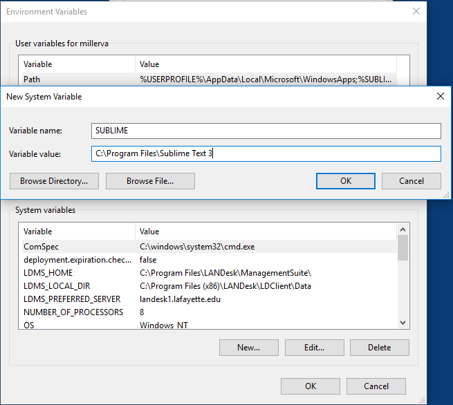
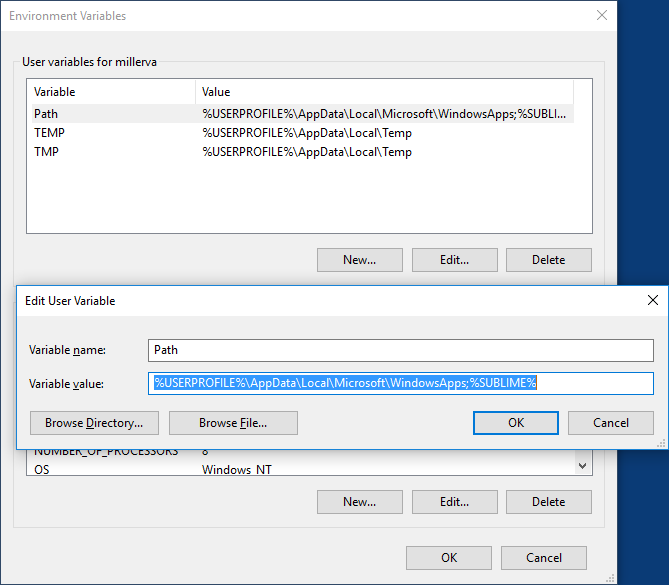

This post is just some notes to remind me how I like to setup a Windows 10 machine for editing scripts.

#### Install and configure Git

First step, install Git. [Download the git installer](https://git-scm.com/download/win). After downloading, run the installer and accept the default settings.

Then add posh-git for Powershell :
Open a Powershell window “as Administrator” and execute the following :

```
set-ExecutionPolicy bypass
git clone git://github.com/dahlbyk/posh-git.git
cd posh-git
./install.ps1
. $PROFILE
```

#### Install and configure Sublime Text

Start by [downloading](https://www.sublimetext.com/3) and installing Sublime Text. Accept the default settings during installation.

Next, we want to be able to launch Sublime Text from the command line. To do this we need to make some changes to our environment variables.

First create a new system variable with a name of SUBLIME and a value of `C:\Program Files\Sublime Text 3`



Next, Edit the user variable Path and append `;%SUBLIME%` to the end.



Now we can simply use subl.exe to launch the editor from a command line.

I like to add some packages to Sublime Text to make it more useful. To do this, first install Package Control. To do this, visit the [Package Control](https://packagecontrol.io/installation#st3) site and follow the instructions.

After installing package control, we can install some packages. Open Sublime Text and press Ctrl-Shift-P. Start typing install into the search box and choose Package Control: Install Package You can now search for useful packages. I like to install support for Powershell and VBScript.

#### Reference Links
http://learnaholic.me/2012/10/12/make-powershell-and-git-suck-less-on-windows/
https://scotch.io/tutorials/open-sublime-text-from-the-command-line-using-subl-exe-windows
