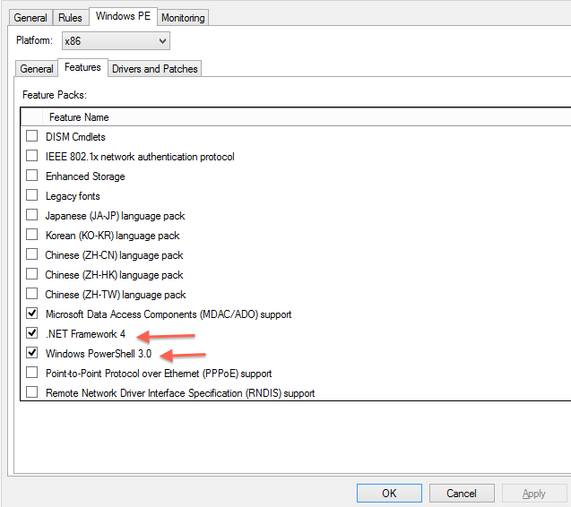

In my recent rework of my Build and Capture sequences that are used for updating my reference images, I thought it would be nice to have an email notification when the process was done.  This post is to show how I did this.

I did this using Powershell’s Send-MailMessage cmdlet.  This provides a simple way to send a message via SMTP, and this MDT 2012u1 provides support for Powershell scripts it seemed a logical choice.  Since I wanted to send the message at the end of a Capture process, I needed to be able to send the message from the WindowsPE environment.

To start, I needed to make sure I had Powershell included in my boot image.  Fortunately this is very easy to do with MDT.  In the deployment workbench right click the deploymentshare and choose “properties”  Click on the Windows PE tab and then on the “Fearures” tab within that.  Check the boxes for .NET frame work and Powershell as shown in the image.



After applying the change, right-click on the deployment share and choose “Update Deploymentshare” to rebuild the boot images.  Once that is completed, remember to update your PXE server to the new boot image, or replace your CDs if using media.

Now for the script.  The script is short, just three lines in fact :

```
$PSEmailServer = "smtp.example.com"
$Subject = "Task Sequence " + $TSEnv:TaskSequenceID " " has completed"
Send-MailMessage -to "Firstname Lastname <user@example.com>" -from "MDT <user@example.com>" -subject $Subject
```

This script will send a message with no body, and a subject that contains the name of the task sequence that called it.  You will need to change the smtp server information and the email addresses to suite your environment.  Save the script into the Scripts folder of the deploymentshare, and we are ready to add it to the task sequence. At the point in the task sequence where you wish the message to be sent, choose Add -> General -> Run PowerShell Script. In the “PowerShell Script:” field enter the following :

```
%scriptroot%\SendMessage.ps1
```

Change the name of the script to reflect the file name you gave it when you saved the script to the Scripts directory, and you are done!  To read more about the Send-MailMessage cmdlet, see the [Technet documentation](http://technet.microsoft.com/en-us/library/hh849925.aspx)