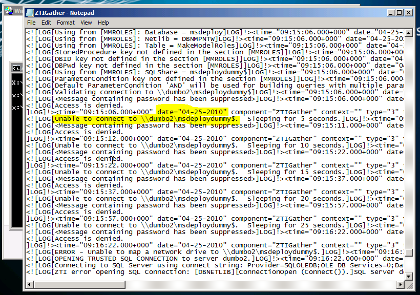

So, a colleague hands me two laptops that are going to be added to our loaner pool.  No problem…  just add the the computer’s information into the MDT database and image them.

Both machines were taking quite a long time for the wizard to come up, and when it did it was obvious that none of the values from the database were coming down.  Both machines were connecting to the deployment share, and had valid IP addresses.  I even booted up a Virtual Machine I use for testing and verified that it was connecting to the database properly.  So what the heck is up with the two problem machines?

Time to do some digging…   At the litetouch wizard screen, press F8 to get a command prompt.  The logs we are interested in are located at  `x:\MININT\SMSOSD\OSDLOGS`  In particular, I am interested in the `ZTIGather.log` file which logs the information gathering process that happens before the wizard is displayed to us.

While the log is a bit difficult to read in Notepad, we can see that the connection to the database is failing.  The multiple retries are the reason it was taking so long.  What jumped out at me (I also highlighted it) was the date for the log entry.  Ah Ha!  the date is wrong.  I corrected the date on the machine, and it then connected fine.